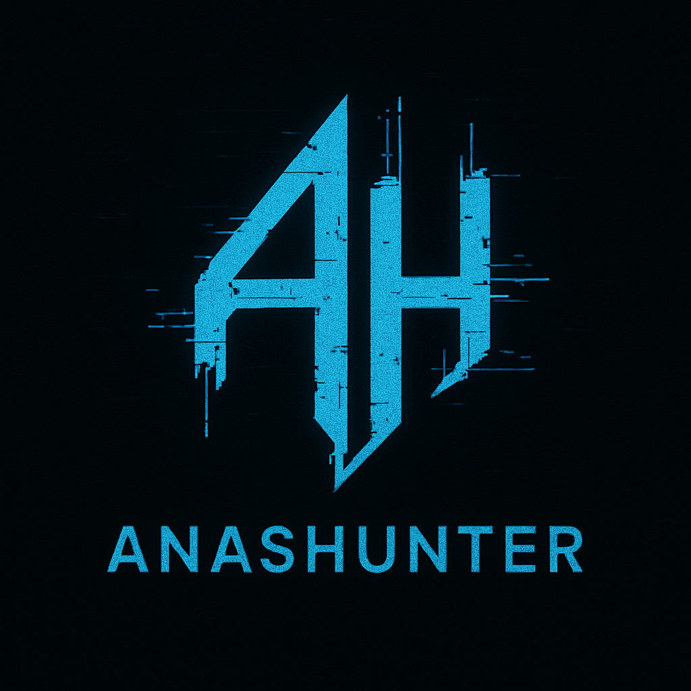

# AnasHunter 🛠



**AnasHunter** is a multi-functional cybersecurity tool for web application penetration testing and vulnerability detection, designed for red team operations. It includes modules for brute force attacks and DDoS testing.
Passionately developed using Python ❤ by [anasslabrini](https://github.com/anasslabrini).
MyWebSite: [anaslabrini](https://anaslabrini.netlify.app)

---

## 📦 Features

-  XSS vulnerability search (Cross Site Scripting)
-  SQLI vulnerability search (sqlinjection)
-  Search for ClickJacking vulnerability
-  Brute Force Attacks
-  Denial of Service attack

---

## 🧰 Requirements

Before using this tool, make sure Python 3 and `pip` are installed.

### 📥 Install Dependencies

```bash
pip install -r requirements.txt
```

---

## 🚀 Installation

1. Clone this repository:

```bash
git clone https://github.com/anasslabrini/AnasHunter.git
cd AnasHunter
```

2. Make the tool executable (for Linux):

```bash
chmod +x anashunter
```

3.Install some requirements:

```bash
bash install.sh
```

4. Running the tool:

```bash
./anashunter
```

---

## 📁 File Structure

```
AnasHunter
├── anashunter
├── bruteforce
│   └── bruteforce.py
├── clickjacking
│   └── clickjacking.py
├── dos
│   └── dos.py
├── install.sh
├── requirements.txt
├── sqli
│   └── sqli.py
└── xss
    └── xss.py
```

---

## ⚠️ Disclaimer

This tool is intended for educational and authorized testing purposes only.  
The author is not responsible for any misuse or illegal activities.  
Always get written permission before testing systems that aren’t yours.

---

## 🪪 License

This project is licensed under the MIT License. See the `LICENSE` file for details.

---

## 👨💻 Author

**Anas Labrini**  
📍 Salé, Morocco  
📧 hackthebox.time@gmail.com


Instagram: [anasans005](https://www.instagram.com/anasans005?igsh=dzNsOXN3Nm9INmVk)
